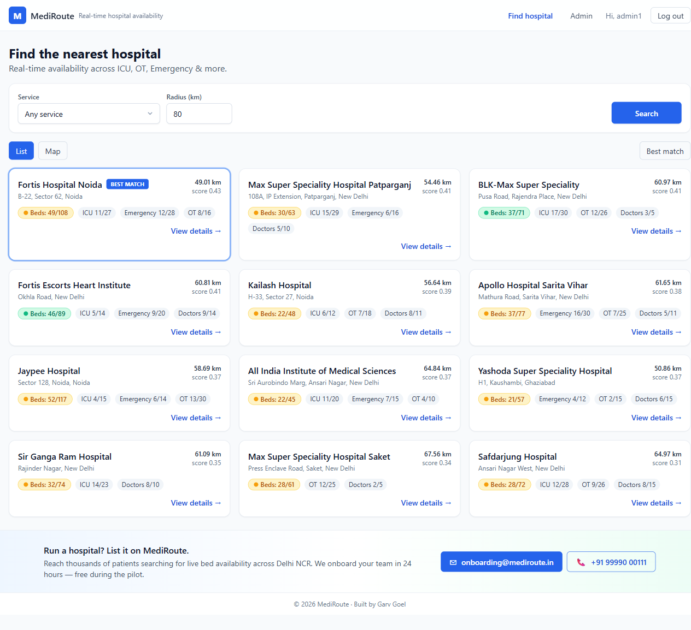
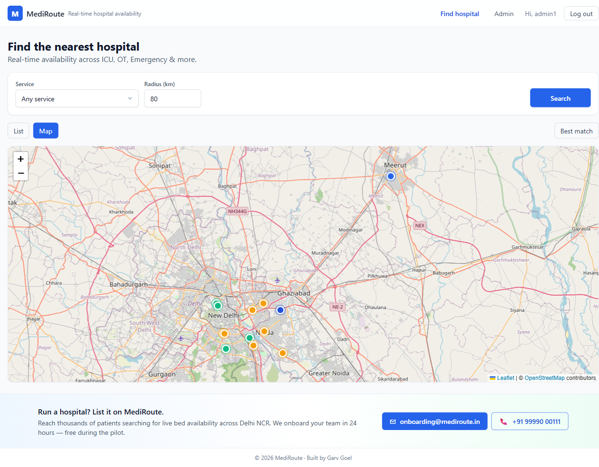
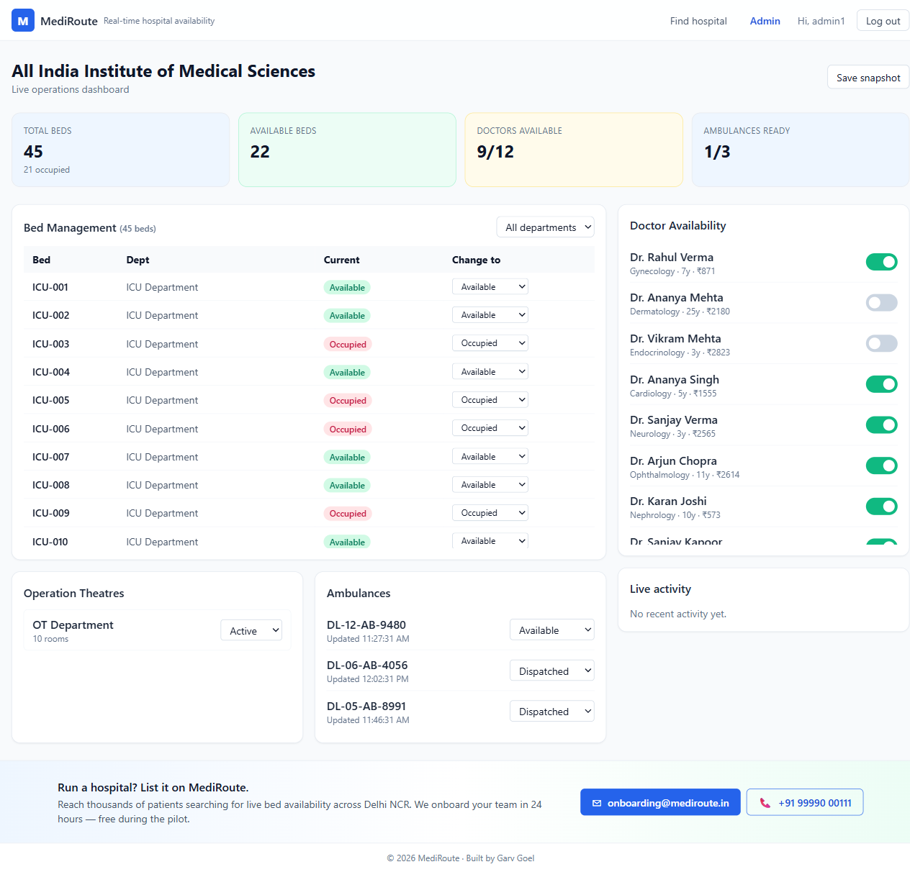
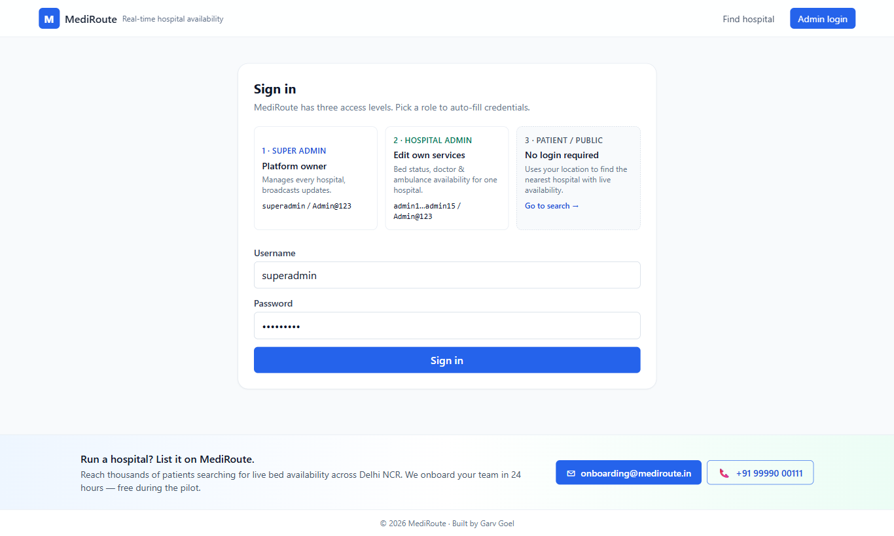

# MediRoute — Real-Time Hospital Resource Navigator


> A live, geolocation-aware platform where patients can find the **nearest hospital with available ICU beds, specialists, emergency services, or OTs** — updated in real time as hospital admins change resource status.

**Author:** Garv Goel · [github.com/garv99goel15](https://github.com/garv99goel15)



---

## The problem

In an emergency, finding a hospital that *actually has the resource you need right now* (an ICU bed, a free OT, a cardiologist on duty) is painful. Public lists are static and out-of-date. MediRoute closes that gap by letting hospital staff update availability in seconds and broadcasting those updates to every patient currently searching, **without a page refresh**.

---

## Architecture

```
                                +-------------------+
                                |     Patients      |
                                |   (React + Vite)  |
                                +---------+---------+
                                          | HTTPS (REST + WebSocket)
                                          v
+----------------+      JWT      +-------------------+      EF Core      +---------------+
|  Hospital      | <---------->  |   ASP.NET Core 8  |  <------------->  |  SQL Server   |
|  Admin Panel   |               |   Web API + Hub   |                   |  (or InMemory)|
+----------------+               +---------+---------+                   +---------------+
                                          |
                                          | SignalR broadcast
                                          v
                                 Patient browsers
                            (live availability badges)
```

Key flow on an admin update:
1. Admin updates a bed/doctor/ambulance.
2. Controller validates + persists via the repository.
3. `AvailabilityService` invalidates the 60-second `IMemoryCache` entry.
4. New availability snapshot is computed and broadcast via `ResourceHub` to the SignalR group `hospital-{id}`.
5. All connected patient browsers in that group receive an `AvailabilityUpdated` event and re-render badges instantly.

---

## Tech stack

| Layer              | Tech                                                  |
| ------------------ | ----------------------------------------------------- |
| Backend            | ASP.NET Core 8 Web API (C#)                           |
| Real-time          | SignalR hub with per-hospital groups                  |
| Database           | SQL Server + EF Core 8 (in-memory option for demos)   |
| Auth               | JWT Bearer (Access 15 min + Refresh 7 days)           |
| Caching            | `IMemoryCache` — 60s availability TTL, 30s search TTL with lat/lng quantization |
| Rate limiting      | Built-in .NET 8 fixed-window limiter (5/min on auth, 60/min on search) |
| Observability      | Serilog structured logging + `/healthz` health check  |
| Validation         | FluentValidation                                      |
| Frontend           | React 18 + TypeScript + Vite (code-split, memoized)   |
| State              | Zustand                                               |
| Maps               | Leaflet.js + react-leaflet (OpenStreetMap tiles)      |
| Styling            | Tailwind CSS                                          |
| Tests              | xUnit + Moq                                           |

---

## Folder structure

```
mediroute/
├── backend/
│   ├── MediRoute.API/            ASP.NET Core 8 Web API + SignalR
│   │   ├── Controllers/          Auth, Hospitals, Beds, Doctors, Ambulances, Admin
│   │   ├── Hubs/                 ResourceHub (real-time)
│   │   ├── Models/               EF entities + enums
│   │   ├── DTOs/                 Request/response contracts
│   │   ├── Data/                 AppDbContext + SeedData (15 hospitals, Delhi NCR)
│   │   ├── Services/             AvailabilityService, HospitalSearchService, AuthService…
│   │   ├── Repositories/         Repository pattern (no DbContext in controllers)
│   │   ├── Validators/           FluentValidation rules
│   │   ├── Middleware/           Global exception handler
│   │   └── Program.cs
│   └── MediRoute.Tests/          xUnit + Moq unit tests
├── frontend/
│   ├── src/
│   │   ├── components/           Map/, Search/, Hospital/, Admin/, shared/
│   │   ├── hooks/                useSignalR, useGeolocation, useHospitalSearch
│   │   ├── pages/                PatientSearch, HospitalDetail, AdminLogin, AdminDashboard
│   │   ├── services/             api.ts (axios + JWT refresh), signalrService.ts
│   │   ├── store/                Zustand stores (auth, hospital)
│   │   └── types/
│   ├── tailwind.config.js
│   └── vite.config.ts
├── .github/workflows/deploy.yml
└── README.md
```

---

## Local setup

### Prerequisites
- .NET SDK **8.0+**
- Node.js **20+** and npm
- (Optional) SQL Server / SQL Server Express — by default the app uses an in-memory database for instant local startup.

### 1) Backend

```bash
cd mediroute/backend
dotnet restore
dotnet run --project MediRoute.API
```

API: <http://localhost:5000> · Swagger: <http://localhost:5000/swagger>
SignalR hub: `http://localhost:5000/hubs/resource`

By default `appsettings.json` has `"UseInMemoryDatabase": true` (seeded automatically). To use real SQL Server, set it to `false` and update `ConnectionStrings:DefaultConnection`, then:

```bash
dotnet ef migrations add Init --project MediRoute.API
dotnet ef database update --project MediRoute.API
```

### 2) Frontend

```bash
cd mediroute/frontend
npm install
npm run dev
```

Open <http://localhost:5173>.

### 3) Seeded login credentials

| Username     | Role           | Hospital |
| ------------ | -------------- | -------- |
| `superadmin` | SuperAdmin     | _all_    |
| `admin1`…`admin15` | HospitalAdmin | 1…15  |

**Password for all:** `Admin@123`

---

## Environment variables

### Backend (`appsettings.json`)

```jsonc
{
  "ConnectionStrings": {
    "DefaultConnection": "Server=.;Database=MediRoute;Trusted_Connection=True;TrustServerCertificate=True;"
  },
  "JWT": {
    "Secret": "REPLACE_WITH_A_LONG_RANDOM_256_BIT_SECRET_KEY_AT_LEAST_32_CHARS",
    "Issuer": "MediRoute",
    "Audience": "MediRouteUsers",
    "AccessTokenExpiryMinutes": 15,
    "RefreshTokenExpiryDays": 7
  },
  "Cache": { "AvailabilityTTLSeconds": 60 },
  "UseInMemoryDatabase": true
}
```

### Frontend (`.env`)

```
VITE_API_BASE_URL=http://localhost:5000
VITE_SIGNALR_HUB_URL=http://localhost:5000/hubs/resource
```

---

## API documentation summary

### Public
| Method | Route                                                   | Description |
| ------ | ------------------------------------------------------- | ----------- |
| GET    | `/api/hospitals/search?lat=&lng=&service=&specialization=&radius=` | Ranked search (Availability × 0.6 + Proximity × 0.4) |
| GET    | `/api/hospitals/{id}`                                   | Hospital detail incl. departments, beds, doctors, ambulances |
| GET    | `/api/hospitals/{id}/availability`                      | Live (cached) availability summary |
| GET    | `/api/hospitals/{id}/doctors?specialization=`           | Doctors filtered by specialization |
| GET    | `/api/hospitals/nearby?lat=&lng=&radius=`               | Hospitals within radius (km) |
| GET    | `/api/hospitals/{id}/snapshot-history?hours=24`         | Historical resource snapshots |

### Admin (JWT, role `HospitalAdmin` or `SuperAdmin`)
| Method | Route                                  | Description |
| ------ | -------------------------------------- | ----------- |
| PUT    | `/api/beds/{id}/status`                | Update single bed status |
| PUT    | `/api/beds/bulk-update`                | Update many beds at once |
| PUT    | `/api/doctors/{id}/availability`       | Toggle doctor available/unavailable |
| PUT    | `/api/ambulances/{id}/status`          | Update ambulance status |
| PUT    | `/api/ot/{departmentId}/status`        | Activate/deactivate an OT |
| GET    | `/api/admin/dashboard`                 | Full resource summary |
| POST   | `/api/admin/snapshot`                  | Persist a resource snapshot |

### Auth
| Method | Route                | Description |
| ------ | -------------------- | ----------- |
| POST   | `/api/auth/login`    | Returns JWT access + refresh tokens |
| POST   | `/api/auth/refresh`  | Exchange refresh token for new pair  |

### SignalR — `/hubs/resource`
- `JoinHospitalGroup(hospitalId)`
- `LeaveHospitalGroup(hospitalId)`
- Server → client event: `AvailabilityUpdated` with `{ hospitalId, updatedResourceType, availability, timestamp }`

---

## Search scoring

```
Score             = (AvailabilityScore × 0.6) + (ProximityScore × 0.4)
AvailabilityScore = available_for_service / total_for_service              ∈ [0,1]
ProximityScore    = 1 - (distance_km / search_radius_km)                   ∈ [0,1]
Distance          = Haversine(lat1,lng1, lat2,lng2)
```
Hospitals with 0 availability for the requested service are filtered out. Top 20 returned.

## Color coding
- 🟢 Green — availability > 50 %
- 🟡 Yellow — 20 – 50 %
- 🔴 Red — < 20 %
- ⚪ Grey — service unavailable / department closed

---

## Tests

```bash
cd mediroute/backend
dotnet test
```

Covers `HospitalSearchService` (scoring, filtering, ranking), `AvailabilityService` (caching, color logic, invalidation) and `RoutingService` (Haversine).

---

## Screenshots

### Patient search — list view with live availability badges


### Patient search — map view (Leaflet, lazy-loaded)


### Hospital admin dashboard — bed / doctor / ambulance management


### Three-role sign-in


---

## Engineering highlights (what makes this resume-worthy)

- **Real-time everywhere.** SignalR `ResourceHub` with per-hospital groups; admin edits push deltas to every patient browser currently viewing that hospital without polling.
- **Layered caching.** Per-hospital availability cached 60 s and invalidated on every admin write. Search results cached 30 s with lat/lng quantized to a ~110 m grid so nearby patients share entries.
- **Bounded memory.** `MemoryCache` size-limited to 10 000 entries to prevent runaway memory under cache-key explosion.
- **Smart search ranking.** Combined Availability (60 %) + Proximity (40 %) score with hard filter on zero-availability for the requested service.
- **Bounding-box pre-filter.** `GetNearbyAsync` narrows DB rows with a lat/lng box before computing Haversine — O(N) over candidates instead of all rows.
- **Rate-limited APIs.** `/api/auth/*` capped at 5 req/min/IP (brute-force defense); `/api/hospitals/search` at 60 req/min/IP.
- **Structured observability.** Serilog request logging + `/healthz` health endpoint with EF Core DB check — plug into any APM/uptime monitor.
- **Auth that doesn’t suck.** JWT access + refresh-token rotation, role-based authorization (`SuperAdmin`, `HospitalAdmin`), JWT-via-query-string support for SignalR.
- **Frontend perf.** Map view (Leaflet ~150 KB gzip) lazy-loaded only when the user clicks Map; `HospitalCard` memoized so a SignalR patch re-renders only the affected card.
- **Graceful geolocation.** Permission-denied falls back to Delhi center with a clear retry banner.
- **Production hardening.** CORS origins driven from configuration (array or CSV env var), Docker image + Render blueprint included.

---

## Deployment

The repo ships with everything needed for a one-click free deploy:

- `backend/MediRoute.API/Dockerfile` — multi-stage .NET 8 image, honors `$PORT` for Render / Fly / Koyeb / any container host.
- `render.yaml` — [Render Blueprint](https://render.com/docs/blueprint-spec) that provisions the backend as a free Docker web service with auto-generated JWT secret and a `/healthz` health check.
- `frontend/vercel.json` and `frontend/public/_redirects` — SPA fallback for Vercel / Netlify / Cloudflare Pages.
- `frontend/.env.production.example` — template pointing at the Render API URL.

For full production CORS, set the env var `Cors__AllowedOriginsCsv` to a comma-separated list of frontend origins.

---

## License
Released — free to use, modify, and distribute with attribution.
